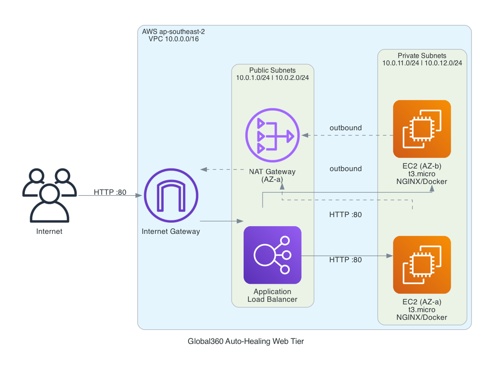

# Global360 — Auto-Healing Web Tier

Self-healing, N+1 web tier on AWS using Terraform. Terminating any single instance triggers automatic replacement with zero downtime.

---

## Why AWS

AWS was chosen for its mature Auto Scaling + ALB ecosystem, the widest free-tier offering (750 hrs/month of t3.micro), and ap-southeast-2 (Sydney) proximity for AUD cost estimation. The ASG + ELB health-check combination is battle-tested for exactly this pattern.

---

## Architecture

```
                      ┌─────────────────────────────────────────────────────┐
                      │                  AWS ap-southeast-2                  │
                      │   ┌───────────────────────────────────────────────┐  │
                      │   │                  VPC 10.0.0.0/16              │  │
                      │   │  ┌──────────────────────────────────────────┐ │  │
  ┌──────────┐        │   │  │           Public Subnets                  │ │  │
  │ Internet │──HTTP──────▶  │  10.0.1.0/24 (AZ-a) · 10.0.2.0/24 (AZ-b) │ │  │
  └──────────┘        │   │  │   ┌────────────────────────────────┐     │ │  │
                      │   │  │   │  Application Load Balancer      │     │ │  │
                      │   │  │   └───────────────┬────────────────┘     │ │  │
                      │   │  │                   │ HTTP :80              │ │  │
                      │   │  │   ┌───────────────▼────────────────┐     │ │  │
                      │   │  │   │  Target Group (health: GET /)   │     │ │  │
                      │   │  │   └──────────┬─────────┬───────────┘     │ │  │
                      │   │  └─────────────┼──────────┼─────────────────┘ │  │
                      │   │  ┌─────────────┼──────────┼─────────────────┐  │  │
                      │   │  │          Private Subnets                  │  │  │
                      │   │  │  10.0.11.0/24 (AZ-a) · 10.0.12.0/24 (AZ-b) │  │
                      │   │  │  ┌──────────▼──┐  ┌───▼──────────┐      │  │  │
                      │   │  │  │ EC2 (AZ-a)  │  │ EC2 (AZ-b)   │      │  │  │
                      │   │  │  │ t3.micro    │  │ t3.micro      │      │  │  │
                      │   │  │  │ Docker/NGINX│  │ Docker/NGINX  │      │  │  │
                      │   │  │  └──────┬──────┘  └──────┬────────┘      │  │  │
                      │   │  │         └────────┬────────┘               │  │  │
                      │   │  │          ┌───────▼──────┐                 │  │  │
                      │   │  │          │ NAT Gateway   │                 │  │  │
                      │   │  │          └──────┬────────┘                 │  │  │
                      │   │  └─────────────────┼──────────────────────────┘  │  │
                      │   │            ┌───────▼──────┐                       │  │
                      │   │            │ Internet GW   │                       │  │
                      │   └───────────────────────────────────────────────────┘  │
                      └─────────────────────────────────────────────────────────┘
```



---

## How Self-Healing Works

1. An EC2 instance crashes or is manually terminated.
2. The ALB marks it unhealthy after 2 failed health checks (~30 s) and stops routing traffic to it.
3. The ASG detects the unhealthy instance and terminates it.
4. A replacement instance is launched in the same or alternate AZ; user-data runs automatically.
5. Once the new instance passes health checks the ALB adds it back to rotation.

At `min_size = 2` with instances spread across two AZs, the surviving instance handles all traffic while the replacement starts — no downtime.

---

## Prerequisites

- Terraform >= 1.9
- AWS CLI configured (`aws configure`) with permissions for VPC, EC2, ALB, and ASG
- Docker (only needed for the optional image build/push step)

---

## Quick Start

```bash
cd terraform

# 1. Initialise providers and modules
terraform init

# 2. Review the execution plan
terraform plan

# 3. Deploy
terraform apply
```

After apply, the ALB DNS name is printed as `alb_dns_name`. Open it in a browser — the page is served by NGINX running inside Docker on each instance.

To verify self-healing:

```bash
# Terminate one instance via the AWS console or CLI
aws autoscaling terminate-instance-in-auto-scaling-group \
  --instance-id <id> --should-decrement-desired-capacity false

# Watch the ASG replace it
aws autoscaling describe-auto-scaling-groups \
  --auto-scaling-group-names global360-prod-asg \
  --query 'AutoScalingGroups[0].Instances[*].{ID:InstanceId,State:LifecycleState}'
```

---

## Bonus: Docker Image

The `docker/` directory contains a minimal NGINX image serving a custom page.

**Build and push to GitHub Container Registry:**

```bash
cd docker

docker build -t ghcr.io/<your-github-username>/global360-web:latest .

echo $GITHUB_TOKEN | docker login ghcr.io -u <your-github-username> --password-stdin

docker push ghcr.io/<your-github-username>/global360-web:latest
```

Each EC2 instance pulls this image on first boot via user-data. If the registry is unreachable, user-data falls back to installing NGINX directly so the instance is never left without a web server.

Update the image reference in `terraform/modules/compute/main.tf` to match your registry path before applying.

---

## Configuration

All tuneable values are in `terraform/variables.tf` and overridden via `terraform/terraform.tfvars`.

| Variable | Default | Description |
|---|---|---|
| `project_name` | `global360` | Prefix for all resource names and tags |
| `environment` | `prod` | Environment tag |
| `aws_region` | `ap-southeast-2` | Deployment region |
| `instance_type` | `t3.micro` | EC2 instance type |
| `asg_min` | `2` | Minimum instances |
| `asg_max` | `4` | Maximum instances |
| `asg_desired` | `2` | Desired instances |

---

## CI/CD Pipeline

`.github/workflows/terraform.yml` runs on every push and pull request touching `terraform/**`.

| Job | Trigger | Steps |
|---|---|---|
| `validate` | all pushes + PRs | `fmt -check` → `init -backend=false` → `validate` |
| `plan` | push to non-main branch + PR | AWS credentials → `init` → `plan` → post output as PR comment |
| `apply` | push to `main` (PR merged) | AWS credentials → `init` → `apply -auto-approve` |

The `apply` job uses a `production` GitHub environment — configure it in repo settings to add a manual approval gate before apply runs.

Required secrets: `AWS_ACCESS_KEY_ID`, `AWS_SECRET_ACCESS_KEY`, `AWS_REGION`.

---

## Assumptions

- **Local state** — no S3 backend configured; add one for team use.
- **Single NAT Gateway** — one NAT GW in AZ-a to minimise cost. A second NAT GW in AZ-b would eliminate the AZ-dependency for outbound traffic but doubles the NAT cost.
- **No bastion / SSH** — instances are in private subnets with SSH denied at the NACL level. Use AWS Systems Manager Session Manager for shell access if needed.
- **HTTP only** — no TLS; add ACM + HTTPS listener to the ALB for production use.
- **Free tier** — cost estimate below assumes outside free tier. New AWS accounts get 750 hrs/month of t3.micro free for 12 months.

---

## Estimated Monthly Cost (AUD, ap-southeast-2, outside free tier)

| Resource | Unit cost | Qty | AUD/month |
|---|---|---|---|
| EC2 t3.micro | ~$0.023 AUD/hr | 2 × 730 hr | ~$33 |
| ALB | ~$0.034 AUD/hr + LCU | 1 | ~$25 |
| NAT Gateway | ~$0.089 AUD/hr + data | 1 | ~$65 |
| EIP (attached) | $0 | 1 | $0 |
| **Total** | | | **~$123** |

With the 12-month free tier, EC2 cost drops to ~$0, bringing the total to ~$90 AUD/month (NAT + ALB).

### Cost-optimised alternative

Replace the NAT Gateway with an Internet Gateway and move EC2 instances into public subnets with public IPs. Inbound traffic is still restricted to the ALB security group — only outbound internet access changes. This eliminates ~$65 AUD/month, dropping the total to **~$58 AUD/month** (~$25 with free tier).

| Resource | AUD/month |
|---|---|
| EC2 t3.micro ×2 | ~$33 |
| ALB | ~$25 |
| Internet Gateway | $0 |
| **Total** | **~$58** |
